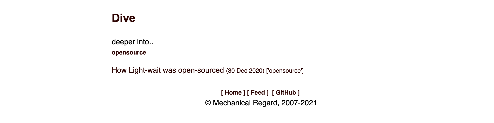

[](http://creativecommons.org/publicdomain/zero/1.0/)


`light-wait` is a blogging platform to produce light (as in features), minimal wait (as in fast to download) content from markdown.

Light-wait produces the bare minimum blog content from markdown files:
* simple overview page with latest posts
* posts per tag (category)
* RSS feed

Example screenshot of blog content:




**Usage**
---

```
Usage: python light-wait.py [OPTIONS]

  Generate blog content from markdown


optional arguments:
  -c COMMAND, --command COMMAND # import or generate
  
  -f FILE, --file FILE          # import src markdown file path
  -n NAME, --name NAME          # import short unique name
  -d DESCRIPTION, --description DESCRIPTION  # import description
  -t TAGS, --tags TAGS          # import tag (category) list
  
  -o OUTPUT, --output OUTPUT    # generate output directory
                        
  -h, --help                    # show this help message and exit  
```

**Quick Start**
---

1. Install with pip

    + `$ pip install -i https://pypi.org/simple/ lightwait`

Use light-wait to generate blog content from existing markdown. First, import your markdown files. 
Here is an example using a markdown about signs:

```
 $ lightwait -c import -f /some/markdown.md -n signs -d 'a new take on signs' -t traffic
```

Next, generate the static content and save to a directory:

```
 $ lightwait -c generate -o /usr/local/var/www/
```

The generated content can be copied to a web server document root. Here is an example 
of running a simple python web server locally using the content generated above:

```
 $ cd /usr/local/var/www/
 $ python3 -m http.server
```

**Configuration Options**
---

Light-wait is designed with customization in mind. Under the HOME_LIGHTWAIT directory is a
INI config file (lightwait.ini):

```
 $ cd ~/.lightwait
 $ ls
 lightwait.ini	markdown	metadata	template	www
 $
```
This python INI file (see configparser) has two sections, DEFAULT and 'lw'. The 'lw' section includes and 
overrides properties in DEFAULT. You can set values in DEFAULT and override any property in lw.

These properties are used both in the html templates and the RSS properties.

Also under HOME_LIGHTWAIT is the html template directory and static content www directory. 

The html temeplates are jinja templates, structured as follows:

    + base template with footer is templates/base.index
    + top level index.html is templates/main.index
    + top level taglists html is templates/tag.index
    + post html is templates/post.index

The static content under www includes modifiable CSS and a favicon

    + under www/css/main.css
    + under www/image/favicon.ico
    

**Running local web server Example**
---
The following is an example of running lighttpd, a fast and lightweight web server,
and generating web content from markdown files, using light-wait.

To install lighttpd on MacOS using homebrew

```
 $ brew update 
 $ brew install lighttpd
 $ brew services start lighttpd
```

This installs a default configuration file /usr/local/etc/lighttpd/lighttpd.conf
which uses port 8080 and a Docroot at /usr/local/var/www

Now generate content using light-wait:

```
 $ lightwait -c generate -o /usr/local/var/www/
```

Then open a browser to http://localhost:8080/

**Tool Chain**
---
markdown
rss feed
favicon
https://redmine.lighttpd.net/projects/1/wiki/HowToInstallOnOSX

**How to Contribute**
---

1. Clone repo and create a new branch: `$ git checkout https://github.com/mechregard/light-wait -b name_for_new_branch`.
2. Make changes and test
3. Submit Pull Request with comprehensive description of changes


**Donations**
---

This is free, open-source software. 


credits image
https://dauntlessfightclub.net/
